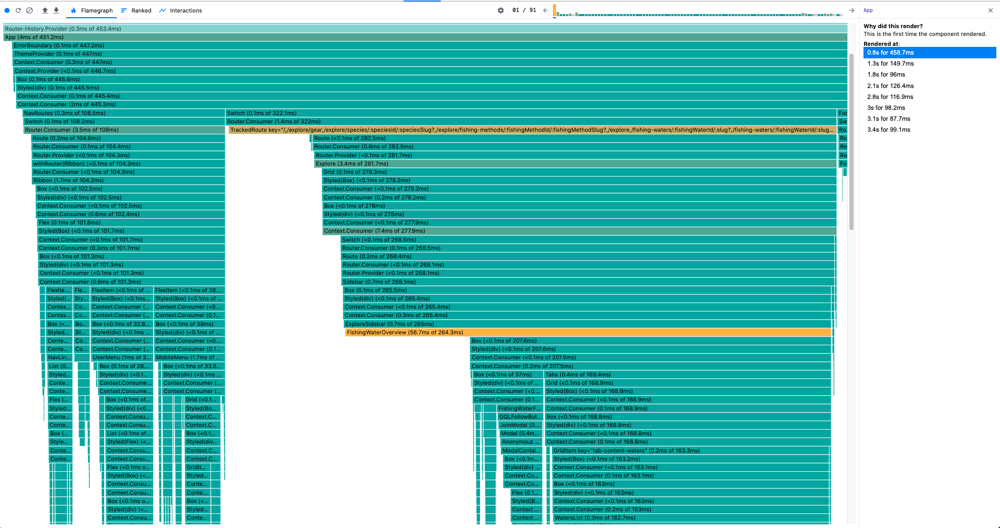
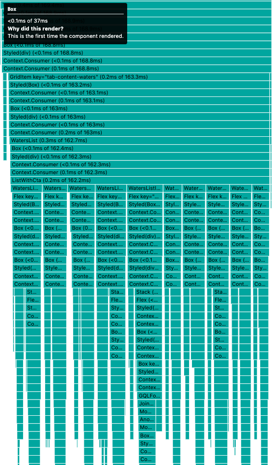
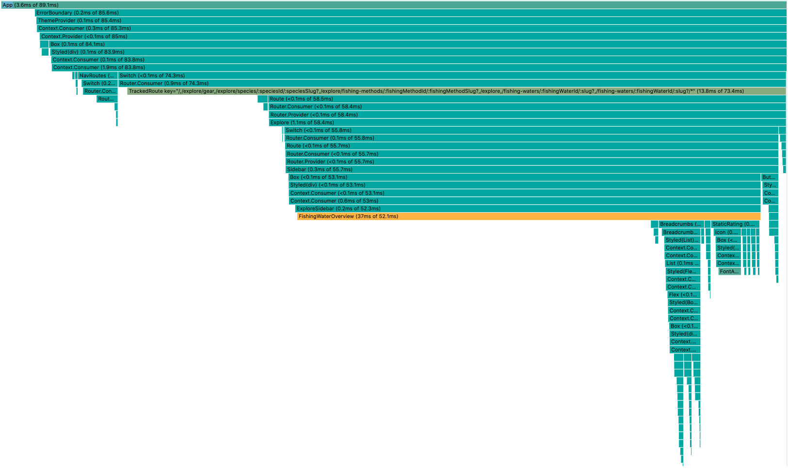

One thing I've been struggling with recently working on [fishbrain.com](https://fishbrain.com) is
the high cost of hydrating server rendered React. While server-side rendering brings us a lot of
benefits, it does take a fair amount of time to hyrdate, which can be particularly frustrating if
you're hydrating elements of the page that the user is not immediately going to interact with, or
even possibly see.

One potential work around is to use the Idle-Until-Urgent pattern. Philip Walton does a far better
job than I can explaining the details of the pattern in [his blog post on the matter](https://philipwalton.com/articles/idle-until-urgent/), so
I'd recommend checking that out, but the basic gist of the pattern is:

- to delay the execution of code until the browser not executing any code (this is the 'idle').
- allow some sort of trigger to execute the code before the idle stage if needed (this is the 'urgent').

What this means for our React use case, is that we would delay hydration of a component either until
the browser stops executing code, or, if the user interacts with the unhydrated element, we can
hydrate it on demand. My implementation was initially based on [another great article from Kumar
Swapnil](https://dev.to/uzumakinarut0/optimizing-react-performance-part-i-n83).

## The code

This a component that will wrap around another React component to make it use the idle-until-urgent
pattern:

```javascript
import React, { useState, ReactNode, useEffect } from 'react';
// This is a simple library we use to tell us if the code is running in Node or in a browser.
import isNode from 'detect-node';

export const IdleUntilUrgent = ({ children, htmlElement }) => {
  const [callbackId, setCallbackId] = useState(null);
  const [renderChild, setRenderChild] = useState(false);

  useEffect(() => {
    if (!isNode) {
      if (typeof window.requestIdleCallback !== 'undefined') {
        // https://caniuse.com/#search=requestIdleCallback
        setCallbackId(
          window.requestIdleCallback(() => {
            setRenderChild(true);
          }),
        );
      } else {
        setTimeout(() => {
          setRenderChild(true);
        });
      }
    }
  }, []);

  if (!isNode && !renderChild) {
    // eslint-disable-next-line react/no-danger-with-children
    return React.createElement(
      htmlElement,
      {
        dangerouslySetInnerHTML: { __html: '' },
        suppressHydrationWarning: true,
        onClick: () => setRenderChild(true),
      },
      null,
    );
  }

  // Cancel the already scheduled render, if any
  if (!isNode && callbackId) {
    window.cancelIdleCallback(callbackId);
  }

  return children;
};
```

In use it would look something like this:

```jsx
<IdleUntilUrgent htmlElement="button">
  <button>Click me</button>
</IdleUntilUrgent>
```

## Breaking it down

First we store the two bits of state we need. A callback ID (so we can cancel the callback if needed),
and a flag telling us if the child should be rendered or not.

```javascript
const [callbackId, setCallbackId] = useState(null);
const [renderChild, setRenderChild] = useState(false);
```

Next we use a `useEffect` hook, triggered only once, that will set a callback using the `requestIdleCallback`
API. This will trigger whenever the browser is idle. As it is not supported in all browsers, we
have a backup option of using a timeout, which will trigger on the next event loop.

```javascript
useEffect(() => {
  if (!isNode) {
    if (typeof window.requestIdleCallback !== 'undefined') {
      // https://caniuse.com/#search=requestIdleCallback
      setCallbackId(
        window.requestIdleCallback(() => {
          setRenderChild(true);
        }),
      );
    } else {
      setTimeout(() => {
        setRenderChild(true);
      });
    }
  }
}, []);
```

If we're rendering in the browser, and we're still waiting for our idle or urgent callback, we want
to skip hydration. This is possible by returning a react element with `dangerouslySetInnerHTML={{ __html: '' }}`.
One thing to note is `onClick: () => setRenderChild(true)`. This is our "Urgent" part of the pattern - if a user
clicks the element we want to hydrate the component immediately.
Another important thing to note is that this will only work if we're rendering the same type of HTML
element - a pitfall I ran into by intially writing something like: `<div dangerouslySetInnerHTML={{ __html: '' }}><button>click me</button></div>`.

```javascript
if (!isNode && !renderChild) {
  // eslint-disable-next-line react/no-danger-with-children
  return React.createElement(
    htmlElement,
    {
      dangerouslySetInnerHTML: { __html: '' },
      suppressHydrationWarning: true,
      onClick: () => setRenderChild(true),
    },
    null,
  );
}
```

The last part is pretty straightforward. Either we're in Node, and we want to render as normal, or
`renderChild` is true, meaning that idle callback was triggered or the user clicked on the element,
so it's time to hydrate (cleaning up our callback along the way).

```javascript
if (!isNode && callbackId) {
  window.cancelIdleCallback(callbackId);
}

return children;
```

## Performance Impact

We opted to test this out on one of our most heavily visited pages on fishbrain.com - the waters
pages ([here's an example of one such page](https://fishbrain.com/fishing-waters/Icur1OcV/brisbane-river)). This
is what the flamegraph for the React render looked like:



Some of the components run so deep that they wouldn't fit on the screen. A particularly bad offender
was the Tabs component:



From this we we're able to identify 4 particular components that were taking a long time to
hydrate while not being something that need render immediately for any user benefit. Wrapping
these components led to a decreased from approximately 450ms to hydrate to <100ms!



We also found that the IdleUntilUrgent components would hydrate pretty quickly after the initial
hydration (usually less than 0.5s), so only an extremely quick user would be able to interact with
an idled component.

## Conclusion

All of the above being said, this is not a pattern we're going to be using this all over the place.
As is usual with these kind of performance hacks, it's something we only want to use in particular
cases, but for those cases it's an impressively useful tool.
